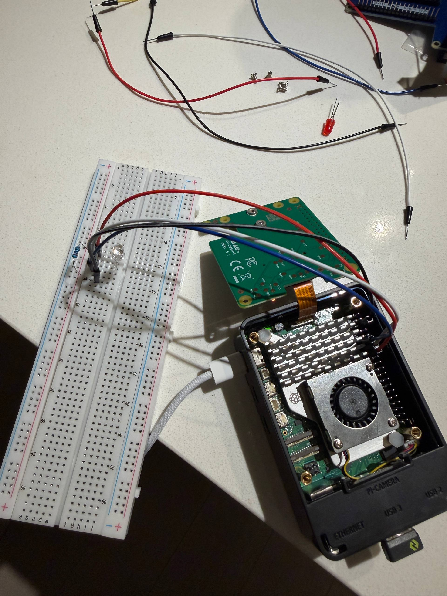

# Pi-Monitor

A hardware-based website monitoring system for Raspberry Pi. It checks a target URL periodically, reflects the status on an RGB LED, and provides a web interface for data visualization and configuration.

## Requirements
*   **Hardware:** Raspberry Pi 5 NVME Version(NOTE: This version maybe has different GPIO pinout, We recommend that you remove the screws securing the SSD, as this will expose the GPIO pins), Breadboard, RGB LED (Common Cathode), 220Ω Resistor.
*   **OS:** Raspberry Pi OS (Debian 12 Bookworm).
*   **Python:** Python 3.11 or higher.

## Directory Structure
```text
pi-monitor/
├── manage.sh              # Bash script to start/stop the service
└── backend/
    ├── run.py             # Main application entry
    ├── monitor.db         # SQLite database (auto-created)
    └── app/               
        ├── models.py      # Database schema
        ├── routes.py      # API endpoints
        ├── hardware.py    # GPIO LED control
        ├── monitor.py     # Background checking loop
        └── templates/     # HTML pages (Dashboard & Dev Console)
```
## Setup Instructions

1. Create a Virtual Environment:
```bash
cd ~/Desktop/pi-monitor/backend
python3 -m venv venv
source venv/bin/activate
```
2. Install Dependencies:
```bash
pip install Flask Flask-SQLAlchemy Flask-Cors requests APScheduler gpiozero rpi-lgpio
```

(Note: rpi-lgpio is required for Raspberry Pi 5 GPIO compatibility).

## How to Run

1. Make the management script executable:
```bash
cd ~/Desktop/pi-monitor
chmod +x manage.sh
```

2. Run the script:
```bash
./manage.sh
```
> Select option [1] to start the service in the background. You can select [4] to view the real-time console logs.

## Web Interfaces
Access the interfaces via a web browser on the same network:

- Dashboard: `http://<PI_IP_ADDRESS>:5000/`
    - View uptime, latency chart, history, and toggle Maintenance Mode.
- Dev Console: `http://<PI_IP_ADDRESS>:5000/dev`
    - Override hardware control, set custom LED colors, or force an instant manual ping.

## Hardware Wiring (Pi 5)
- GND (Longest Pin): Physical Pin 6 (via 220Ω resistor)
- Red Pin: GPIO 22 (Physical Pin 15)
- Green Pin: GPIO 27 (Physical Pin 13)
- Blue Pin: GPIO 17 (Physical Pin 11)


